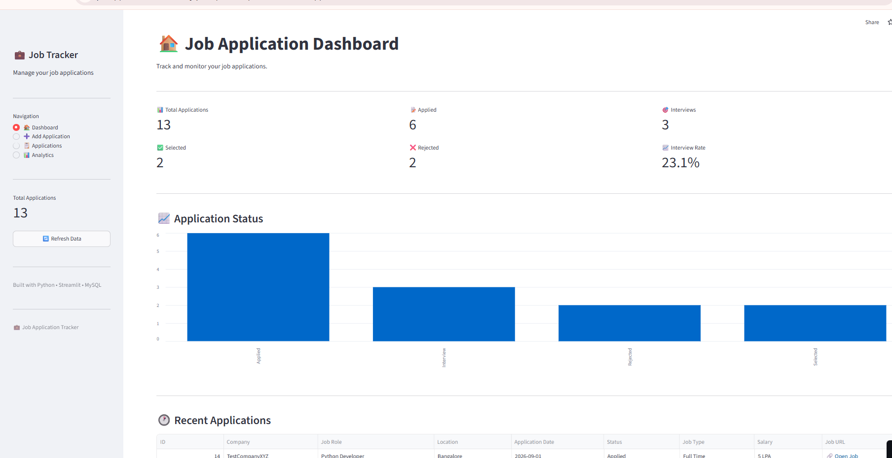
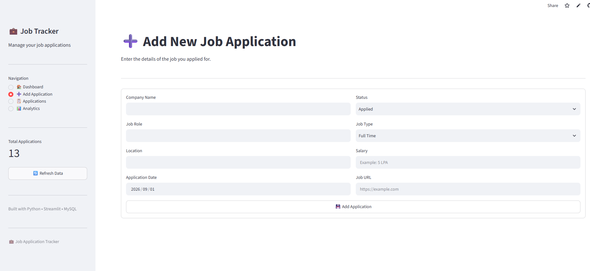
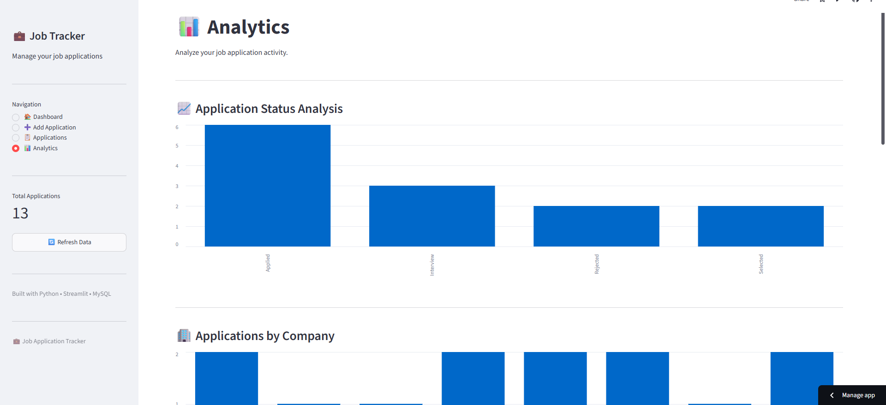

# 💼 Job Application Tracker

A full-stack Job Application Tracker built using Python, Streamlit, and MySQL/TiDB Cloud.

## 🌐 Live Demo

[Open Job Application Tracker](https://jobapplicationtracker-imjqzxudpvhrltudpcl775.streamlit.app/)

## 💻 GitHub Repository

[View Source Code](https://github.com/Kowsalyaramesh01/Job_Application_Tracker)

## 🚀 Features

- Add job applications
- Duplicate application prevention
- Search applications
- Filter by company, role, status and date
- Update application status
- Delete applications
- Dashboard analytics
- Interview rate calculation
- Company and job-role analytics
- CSV export
- Cloud database integration

## 🛠️ Technologies

- Python
- Streamlit
- Pandas
- MySQL / TiDB Cloud
- Git & GitHub

## 📊 Dashboard

The application provides a dashboard for tracking:

- Total Applications
- Applied
- Interviews
- Selected
- Rejected
- Interview Rate

## 🗄️ Database

The application stores:

- Company Name
- Job Role
- Location
- Application Date
- Status
- Job Type
- Salary
- Job URL

## 📸 Screenshots

## 📸 Screenshots

### 🏠 Dashboard



### 📋 Applications



### 📊 Analytics



## ▶️ Run Locally

Install dependencies:

```bash
pip install -r requirements.txt